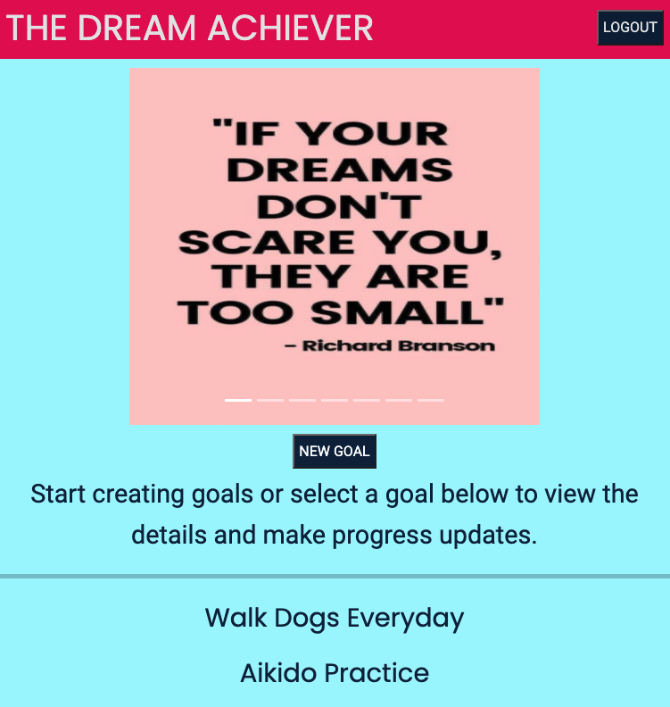

# The Dream Achiever

User can signup/login and create goals and add status updates to related goal.
User will also be able to see carousel of positive quotes on main page.

Live Site:
<a href="https://the-dream-achiever.netlify.app/">The Dream Achiever</a>

React Router Table 

    -> App
    -> Global
      -> Header
        -> Switch
          ->Route exact path="/"
            ->Home
          ->Route path="/signup"
            ->Signup
          ->Route path="/login"
            ->Login
          ->Route path="/main"
            ->Main
          ->Switch
            ->Switch
            ->Route exact path="/main"
              ->AllGoals
                goals={goals}
            ->Route exact path="/main/goal/:id"
              ->SingleGoal
                goals={goals}
                edit={getTargetGoal}
                deleteGoal={deleteGoal}
                updates={updates}
                deleteUpdate{deleteUpdate}
            ->Route path="/main/new"
              ->Form
                state={state}
                initialGoal={nullGoal}
                handleSubmit={addGoal}
                buttonLabel="CREATE"
            ->Route path="/main/goals/:id/update"
              ->FormUpdate
                state={state}
                handleSubmit={addUpdate}
                updates={updates}
                goals={goals}
                buttonLabel="UPDATE"
            ->Route path="/main/edit"
               ->Form
                initialGoal={targetGoal}
                handleSubmit={updateGoal}
                buttonLabel="UPDATE"
Technologies:
- React

- Bootstrap with Material Design for carousel
  - mdb-react-ui-kit
  - https://mdbootstrap.com/docs/react/

- User authentication/authorization with JWT

- JavaScript, CSS, HTML

- Backend API Ruby on Rails/PostgreSQL DB

Styling:
- Favicon: https://favicon.io/emoji-favicons/
- Responsive Design with media queries.

Future Improvements:
- Rebuild for better and more complex backend api models
- Actionmailer with Ruby to send user email reminders
- Add third party API to backend
  - https://github.com/misselliev/affirmations-api
  - https://github.com/annthurium/affirmations/blob/master/affirmations.js
- Better storage for error handling with token state look into npm install react-cookie
- Add Loading Image for delayed inital API call for user credentials

Trello:
- https://trello.com/b/gm3yRArm/goal-setter

Backend: 
- https://github.com/katiepestotnik/goal-setter-jwt-api
- https://goal-setter-auth.herokuapp.com

Challenges:
- Page refresh breaking app. Added error handling to check !token as well as optional chaining to handle the return map items.
  - Now user is redirected to login page only on localhost
  - Deploy fails, looking into webpack-dev-server/api history fallback
- Nesting URLs correctly especially to get the updates to add to the specific goal
- Handling responsive design with Bootstrap added. I prefer to do my own styling but used Bootstrap for carousel.
- Completed in Update Model, handling the Boolean value and getting it to display properly once user selects checkbox. Fixed with !! in the form input element: {!!formData.completed?false:true}